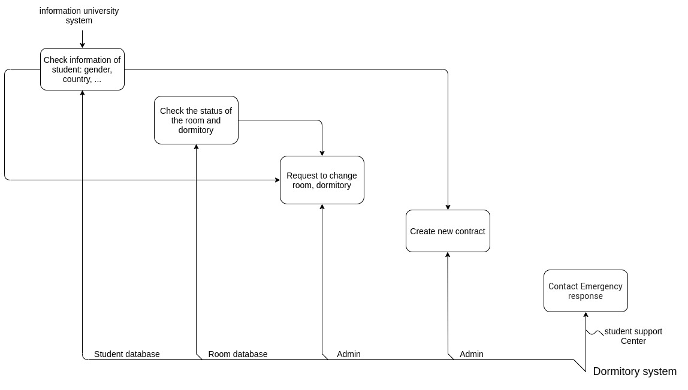
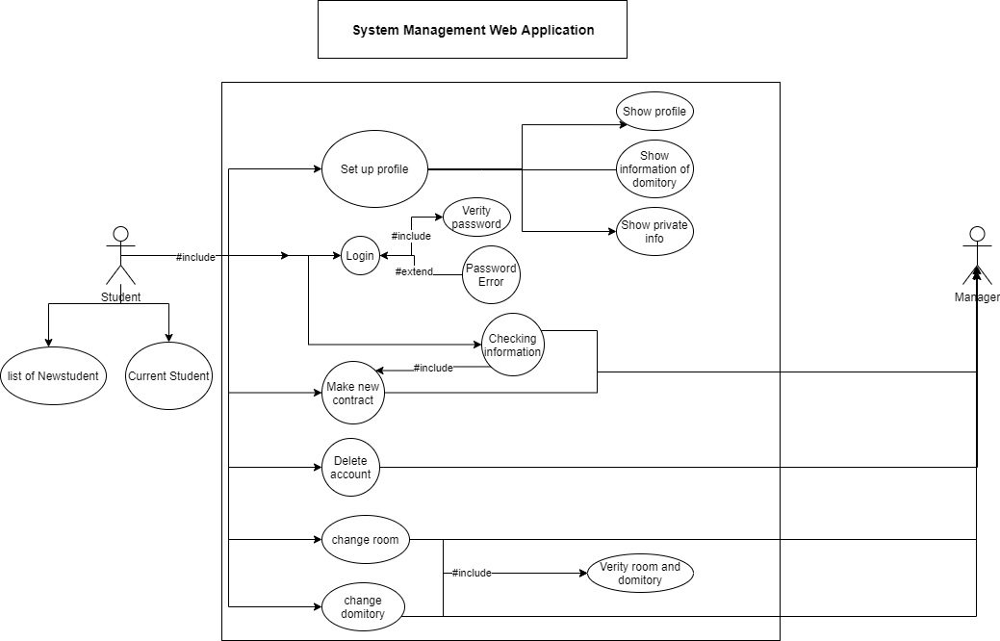
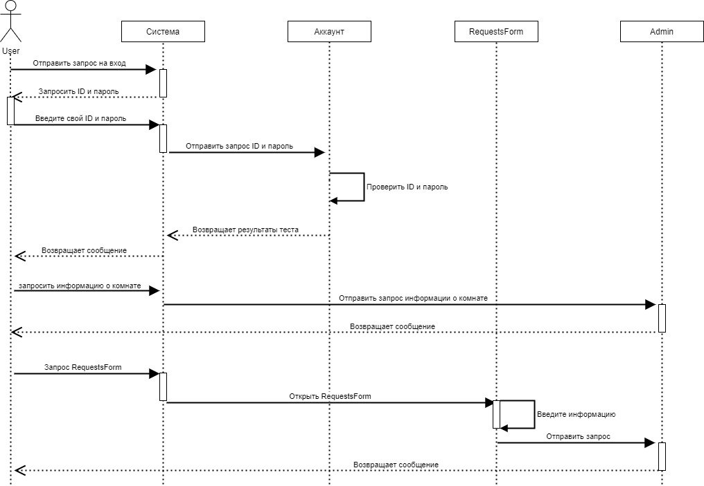
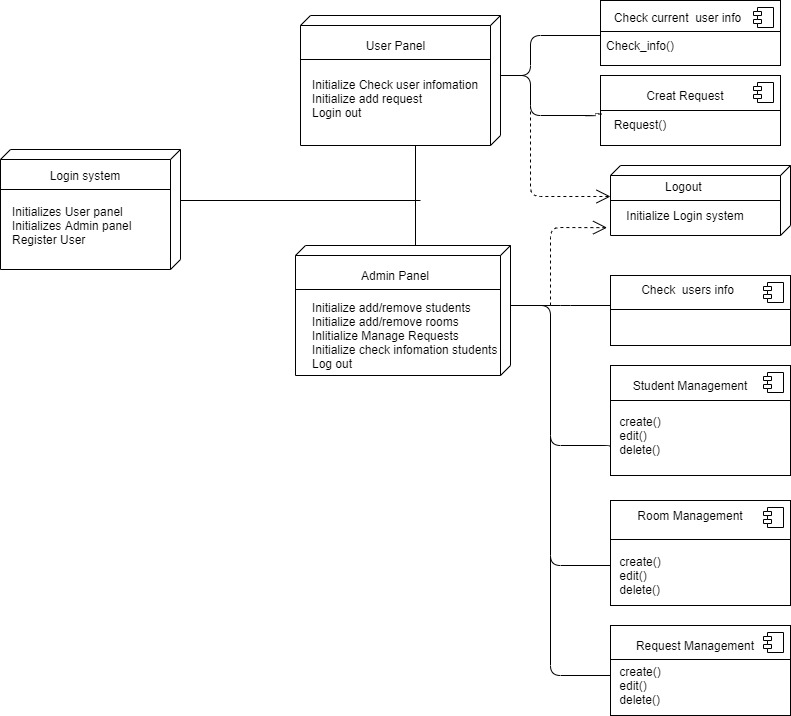

# Flask-SQL Docker depoly for Domitory system
## Technical program


## Using this project

This project is a template. We recommend the following workflow:

- Clone this repository.
- Start the Docker container:

```
$ docker build -t <TAG NAME> . --network=host
$ docker run -p 80:80 -d <IMAGE ID>.
```

- Verify that `<IP address of Docker machine>/flask-nginx` works, i.e. that Nginx is properly delegating to flask-nginx.
- Move your code into the flask-nginx application, renaming things as needed.

**Admin**
```
admin
admin1234
```

## Installation

**Installation via `requirements.txt`**:
- Rename .env.example to .env
```shell
$ git clone https://github.com/manhlab/domitory-project.git
$ cd flasklogin-tutorial
$ python3 -m venv myenv
$ source myenv/bin/activate
$ pip3 install -r requirements.txt
$ flask run
```
**On Windows**:
```shell
$ git clone https://github.com/manhlab/domitory-project.git
$ cd flasklogin-tutorial
$ python3 -m venv myenv
$ myenv/bin/activate.bat
$ pip3 install -r requirements.txt
$ flask run
```
## Этап 1. Проанализировать выбранный вариант описания проектируемой системы.
Это будет программа управления записями данных студентов Университета ИТМО. Внесение изменений в архивную комнату, решение проблем, связанных с общежитием.
Выбираем тему систем общежитий вузов. Это одна из практических тем, актуальных для реальности и весьма актуальных в студенческой жизни. Это делает работу общежития более быстрой и легкой.
О разработанной системе: Мы создаем веб-сайт, который легко и легко визуализировать. Там мы оставили небольшие разделы о школьной информации и о том, как создать учетную запись на нашем сайте.
Существует два типа учетных записей для регистрации, а именно: учетная запись владельца (или принципала) и учетная запись студента. Это будет учетная запись администратора с прямым доступом к системе для просмотра всей информации. А аккаунт студента используется для декларирования личных календарей. Получить доступ и запросить право регистрироваться, снимать комнаты, переезжать и распределять жилье среди студентов надлежащим образом. И человек, который одобряет эти вещи, будет хозяином общежития вместе с созданным нами сайтом.
Это наша цель в разрабатываемой системе.

## Этап  2. Выделить необходимый набор сущностей, отражающих предметную область для представления в рамках реляционной модели. Определить необходимый набор атрибутов каждой сущности, выделив идентифицирующие атрибуты. Определить сущности вида подтип/супертип. Определить связи между сущностями. Формализовать связи вида 1:1, 1:M, M:N. 
## Этап  3. Реализовать диаграмму «сущность-связь» модели базы данных в нотации IDEF1X. 

Выберите необходимый набор сущностей:
Сущность в нашей модели взаимоотношений - это комната студента и общежития.
Определите группу атрибутов каждого объекта:
	Для каждой сущности мы описываем и определяем ее в соответствии с конкретными факторами и способами действия каждого субъекта.
	Для групп учащихся мы даем каждому следующее:
Отдельный идентификационный номер для каждого человека: 
id = db.Column(db.Integer, primary_key=True)
Их имя и адрес электронной почты: 
name = db.Column(db.String(100), nullable=False, unique=False) 
email = db.Column(db.String(40), unique=True, nullable=False)
Пароль учетной записи: 
password = db.Column( db.String(200), primary_key=False, unique=False, nullable=False)
Далее следует предварительная информация о том, как быть членом общежития.: passport-address-sex-dateobird-telephone-numberDomitory-room-numofcontract-startcontract-endofcontract-created_on-last_login.
В соответствии с методом действий каждого учащегося им разрешается делать следующее:
Create hashed password
Check hashed password
Запросить размещение
Запросить перенос номера
Запросить услуги, доступные в общежитии
Для комнат у нас есть следующие элементы:
Укажите идентификатор для каждой комнаты: 
id = db.Column("room_id", db.Integer, primary_key=True)
Название комнаты: 
room = db.Column(db.Integer, nullable=False)
Количество комнат в общежитии: 
numberDomitory = db.Column(db.Integer, nullable=False)
И множество других отличительных особенностей: gender-number_person-type_room-price_room-empty_position-status_room => info.

Отношения между сущностями будут описаны в виде 1: 1, 1: M и M: N.
1:1
Для индивидуального студента, или даже комнаты в любом общежитии. Все они идентифицированы нами, и им присваивается уникальный идентификационный номер для идентификации и классификации.
Невозможно использовать информацию об отделе или дисциплине студента для идентификации этого человека, поскольку на отделении может быть более одного студента. Также невозможно использовать номер комнаты для идентификации студента, потому что в одной комнате может находиться до 2-3 студентов. Итак, id - это наиболее точное описание этого студента.
Как и в случае с жилыми комнатами, по количеству комнат нельзя точно определить, что это за комната, потому что в разных комнатах может быть одинаковое количество комнат. Таким образом, идентификатор комнаты - это наиболее точное определение комнаты.
Это отношение 1: 1 между комнатой и учеником через id. Элемент описывает только один источник
1:M
С отношением 1: M означает, что один объект содержит (включает в себя множество других объектов) или набор нескольких объектов, которые отражают только другой объект.
Для студентов и студентов размещение в общежитии. Студент может жить только в одной комнате, но в одной комнате может быть много разных студентов. Таким образом, в одной комнате находится множество других студенческих организаций. Другими словами, это группа студентов из 2-3 человек для комнаты, в которой они живут.
Это соотношение 1: M, когда в комнате общежития много студентов.
M:N
В отношении M: N это набор многих сущностей, которые отражают или определяют набор многих других сущностей. Каждому ученику нужно сдать много тестов во время экзамена. И эти экзамены сдают многие другие студенты. Таким образом, многим студентам приходится сдавать множество тестов, и наоборот, многие студенты их делают. Это отношения M: N

## Этап  4.Создать базу данных для СУБД и сгенерировать sql-скрипт для задания структуры базы данных. Выполнить анализ sql-скрипта создания базы данных и ассоциированных с ней объектов (таблиц и ограничений). 
 ```
 class User(UserMixin, db.Model):
    """User account model."""

    __tablename__ = "flasklogin-users"
    id = db.Column(db.Integer, primary_key=True)
    name = db.Column(db.String(100), nullable=False, unique=False)
    email = db.Column(db.String(40), unique=True, nullable=False)
    password = db.Column(
        db.String(200), primary_key=False, unique=False, nullable=False
    )
    passport = db.Column(db.String(200), nullable=False)
    address = db.Column(db.String(200), nullable=False)
    sex = db.Column(db.String(200), nullable=False)
    dateofbird = db.Column(db.Date(), nullable=False)
    telephone = db.Column(db.Integer, nullable=False)
    numberDomitory = db.Column(db.Integer, nullable=True)
    room = db.Column(db.Integer, nullable=True)
    numofcontract = db.Column(db.Integer, nullable=True)
    startcontract = db.Column(db.Date(), nullable=True)
    endofcontract = db.Column(db.Date(), nullable=True)
    created_on = db.Column(db.DateTime, index=False, unique=False, nullable=True)
    last_login = db.Column(db.DateTime, index=False, unique=False, nullable=True)

    def set_password(self, password):
        """Create hashed password."""
        self.password = generate_password_hash(password, method="sha256")

    def check_password(self, password):
        """Check hashed password."""
        return check_password_hash(self.password, password)

    def __repr__(self):
        return "<User {}>".format(self.name)

    @property
    def is_authenticated(self):
        return True

    @property
    def is_active(self):
        return True

    @property
    def is_anonymous(self):
        return False

    def get_id(self):
        return self.id

    # Required for administrative interface
    def __unicode__(self):
        return self.name


class Rooms(UserMixin, db.Model):
    __tablename__ = "rooms"
    __bind_key__ = "rooms"
    id = db.Column("room_id", db.Integer, primary_key=True)
    room = db.Column(db.Integer, nullable=False)
    numberDomitory = db.Column(db.Integer, nullable=False)
    gender = db.Column(db.String(40), nullable=False)
    number_person = db.Column(db.Integer, nullable=False)
    type_room = db.Column(db.String(250), nullable=False)
    price_room = db.Column(db.Integer, nullable=False)
    empty_position = db.Column(db.String(250), nullable=False)
    status_room = db.Column(db.String(250), nullable=False)
    info = {"bind_key": "rooms"}

    def __repr__(self):
        return "<Room %r>" % self.room
    def __unicode__(self):
        return self.room


class RequestsForm(UserMixin, db.Model):
    __tablename__ = "request"
    __bind_key__ = "request"
    id = db.Column("request_id", db.Integer, primary_key=True)
    email = db.Column(db.String(40), nullable=False)
    request_type = db.Column(db.String(250), nullable=False)
    request_mess = db.Column(db.String(250), nullable=True)
    status_request = db.Column(db.String(250), nullable=True)
    info = {"bind_key": "request"}

    def __repr__(self):
        return "<Request %r>" % self.email
    def __unicode__(self):
        return self.email
```
## Этап  5.Создать и выполнить запросы на добавление данных в таблицы (данные придумать самостоятельно). Создать и выполнить запросы на выборку данных из таблиц согласно условию 
∙ Простой выбор данных (SELECT, *, FROM, WHERE, ORDER BY, вычислимые поля, DISTINCT). 
∙ Внешнее объединение таблиц. 
∙ Выбор данных с помощью группирующих запросов с условием (GROUP BY, HAVING, MIN(), MAX(), SUM(), COUNT(), …). 
∙ Выбор данных с помощью подзапросов. 
```
user = User(
                name=form.name.data,
                email=form.email.data,
                address=form.address.data,
                passport=form.passport.data,
                sex=form.sex.data,
                telephone=form.phone.data,
                dateofbird=form.bird.data,
                created_on=datetime.datetime.now(),
                last_login=datetime.datetime.now(),
            )
            user.set_password(form.password.data)
            db.session.add(user)
            db.session.commit()  # Create new user
```

## Этап  6. Создать Web форму для выполнения запросов к серверной базе данных Адаптировать имеющиеся запросы и/или реализовать новые. 
```
if existing_user is None:
            user = User(
                name=form.name.data,
                email=form.email.data,
                address=form.address.data,
                passport=form.passport.data,
                sex=form.sex.data,
                telephone=form.phone.data,
                dateofbird=form.bird.data,
                created_on=datetime.datetime.now(),
                last_login=datetime.datetime.now(),
            )
            user.set_password(form.password.data)
            db.session.add(user)
            db.session.commit()  # Create new user
```
## Этап  7. Построить функциональную диаграмму в нотации IDEF0 для всей информационной системы в целом и для отдельных сценариев, отражающих логику и взаимоотношение подсистем. Реализовать IDEF0-модель. Заполнить глоссарий IDEF0-модели. Проверить корректность разработанной модели. 

## Этап  8.   Построить диаграмму потоков данных для проектируемой информационной системы в нотации Йордона - Де Марко или Гейна - Сарсона. 

## Этап  9. Проанализировать выбранный вариант описания проектируемой системы. Сформулировать требования к системе с применением диаграммы прецедентов. Создать начальную версию диаграммы прецедентов. 

## Этап  10. Создать модель статической структуры системы и связей между ее элементами с помощью диаграммы классов. Реализовать диаграмму классов. 
## Этап  11.Создать модель процесса обмена сообщениями между объектами в виде диаграмм последовательностей и кооперации. Реализовать диаграммы последовательностей и кооперации. 

## Этап  12. Создать модель поведения системы в рамках прецедентов с помощью диаграмм деятельностей. Реализовать диаграммы деятельностей. 

## Этап 14.Реализовать диаграмму развертывания системы.
