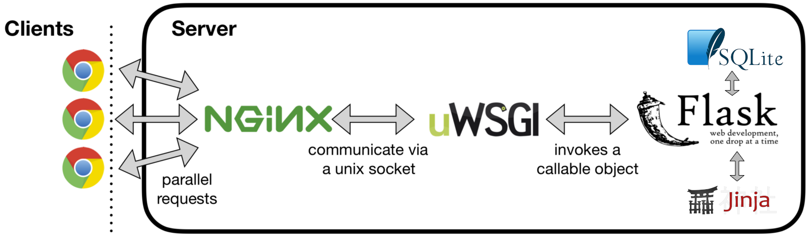

# Flask-SQL Docker depoly for Domitory system

## Using this project

This project is a template. We recommend the following workflow:

- Clone this repository.
- Start the Docker container:

```
$ docker build -t <TAG NAME> . --network=host
$ docker run -p 80:80 -d <IMAGE ID>.
```

- Verify that `<IP address of Docker machine>/flask-nginx` works, i.e. that Nginx is properly delegating to flask-nginx.
- Move your code into the flask-nginx application, renaming things as needed.

**Admin**
```
admin
admin1234
```

## Installation

**Installation via `requirements.txt`**:
- Rename .env.example to .env
```shell
$ git clone https://github.com/manhlab/domitory-project.git
$ cd flasklogin-tutorial
$ python3 -m venv myenv
$ source myenv/bin/activate
$ pip3 install -r requirements.txt
$ flask run
```
**On Windows**:
```shell
$ git clone https://github.com/manhlab/domitory-project.git
$ cd flasklogin-tutorial
$ python3 -m venv myenv
$ myenv/bin/activate.bat
$ pip3 install -r requirements.txt
$ flask run
```
## Technical program

## Task 7

## Task 11

## Task 14
